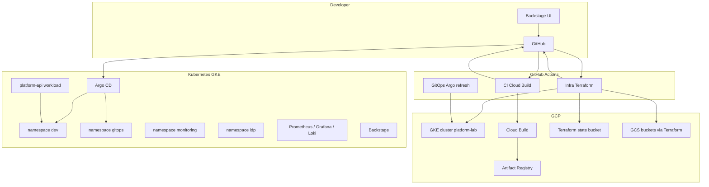

# Platform Engineering Lab — Full Project Documentation

> **Purpose:** Single reference for demos, onboarding, and feeding other LLMs. Describes **what this repository does**, **how components connect**, and **what is automated vs manual**.

---

## 1. Executive summary

This repo implements a **low-cost, dev-focused internal platform** on **Google Cloud (GCP)**:

| Capability | Implementation |
|------------|------------------|
| **Internal Developer Platform (IDP)** | **Backstage** — catalog, scaffolder templates for GCP (e.g. GCS bucket, VPC) → Git PR → Terraform |
| **GitOps for the runtime app** | **Argo CD** — syncs Kubernetes manifests from Git (`gitops/overlays/dev`) to cluster namespace `dev` |
| **Application CI** | **GitHub Actions** + **Google Cloud Build** — build container image, push to Artifact Registry, bot commits image tag to GitOps |
| **Infrastructure as code** | **Terraform** under `infra/` — state in **GCS**; CI plans/applies on PR/merge |
| **Observability** | **kube-prometheus-stack** (Prometheus + Grafana + Alertmanager) + **Loki** stack — installed via Helm scripts |

**Design theme:** **Git is the source of truth** for what Argo CD deploys. **GCP resources** (buckets, etc.) are created by **Terraform**; visibility in Argo is **mirrored** via generated ConfigMaps/Config, not live GCP API polling.

---

## 2. Goals and non-goals

### Goals

- One **dev** environment (no staging/prod in current GitOps path).
- **Template → PR → Terraform → GCP** for selected resources (not “generate files only”).
- **Low cost:** single-node or small spot GKE, **port-forward** for UIs (no mandatory cloud load balancers).
- **Automation:** CI updates GitOps after infra apply; optional Argo refresh in-cluster after infra pipeline.

### Non-goals / limitations

- Argo CD **does not** subscribe to GCP events. Resources created **only** in GCP Console **will not** appear in Argo until represented in **Git** (Terraform + CI).
- Not a full multi-tenant production platform (auth, SLAs, HA are lab-oriented).

---

## 3. High-level architecture



**Data flow (simplified):**

1. **App delivery:** Push to `main` → **CI** builds image in **Cloud Build** → pushes to **Artifact Registry** → **bot** updates `gitops/base/deployment.yaml` → **Argo** syncs → **Deployment** in `dev`.
2. **Infra:** Change `infra/**` on `main` → **Infra Terraform** applies changed stacks → regenerates GitOps files (runtime ConfigMap, bucket ConfigMaps, Argo Application info) → **bot** commits → **argocd-sync** job applies `argocd/dev-app.yaml` + hard-refresh Application (if GCP credentials allow).
3. **IDP:** **Backstage** helps authors open PRs with Terraform; merge still goes through GitHub.

---

## 4. Technology stack

| Layer | Technologies |
|-------|----------------|
| Cloud | GCP: GKE, GCS, Artifact Registry, Cloud Build, IAM |
| Orchestration | Kubernetes |
| GitOps | Argo CD v2.x |
| CI | GitHub Actions |
| Build | Cloud Build (`gcloud builds submit`) — no local Docker required for CI |
| IaC | Terraform (Google provider), remote state in GCS |
| IDP | Backstage (Helm chart), Software Templates, Catalog |
| Observability | Prometheus, Grafana, Alertmanager, Loki + Promtail (Helm) |
| App | Sample **`platform-api`** (container in `app/` or repo root per Cloud Build config) |

---

## 5. Repository layout (map)

```
platform/
├── .github/workflows/
│   ├── ci-cloudbuild.yml          # Build/push image; commit deployment image tag
│   ├── infra-terraform.yml      # TF plan (PR), apply + regenerate GitOps + Argo sync (push)
│   └── gitops-argoc-refresh.yml # kubectl apply Application + hard refresh (gitops/argocd pushes)
├── app/                          # Application source (served/built per Cloud Build)
├── argocd/
│   └── dev-app.yaml              # Argo CD Application CR (namespace gitops)
├── gitops/
│   ├── base/                     # Kustomize base: Deployment, Service, ConfigMaps, bucket nodes
│   └── overlays/dev/             # Dev overlay (namespace dev)
├── infra/
│   └── gcp-storage/<stack>/      # One Terraform module per bucket stack; outputs bucket_name
├── idp/
│   └── backstage-values-dev.yaml # Helm values for Backstage
├── monitoring/                   # PrometheusRules, Grafana/Alertmanager values, demo docs
├── scripts/                      # Bootstrap: GKE, Backstage, Argo CD, observability, tunnels, health
├── templates/                    # Backstage Software Templates (GCP bucket, VPC, etc.)
├── terraform-idp/                # Optional separate TF for team namespaces (legacy path)
├── docs/
│   └── PLATFORM_DOCUMENTATION.md # This file
└── README.md
```

---

## 6. Kubernetes layout (namespaces)

| Namespace | Contents |
|-----------|----------|
| `dev` | **platform-api** Deployment, Service, ConfigMaps (runtime config, generated bucket markers) |
| `gitops` | **Argo CD** install, **Application** `platform-api-dev` |
| `monitoring` | **kube-prometheus-stack**, **Loki** |
| `idp` | **Backstage** |

Default cluster name: **`platform-lab`**, zone **`us-central1-a`** (see scripts and workflow `env`).

---

## 7. GitOps: Argo CD application

- **Application name:** `platform-api-dev` (namespace `gitops`)
- **Source:** Git repo `main`, path **`gitops/overlays/dev`**
- **Destination:** cluster default, namespace **`dev`**
- **Sync:** automated prune + selfHeal
- **`spec.info`:** populated by **Infra Terraform** CI with Terraform outputs (bucket list, VPC fields) — **not** hand-maintained for each bucket

**Important:** The **Application** manifest file lives at **`argocd/dev-app.yaml`** in the repo; it is **outside** the synced path `gitops/overlays/dev`. CI can **kubectl apply** it so the **Summary** panel updates without manual steps.

---

## 8. Workloads and naming

| Concept | Name |
|---------|------|
| Argo Application | `platform-api-dev` |
| Deployment / Service | `platform-api` |
| Runtime env ConfigMap | `platform-runtime-config` (keys like `GCP_STORAGE_BUCKETS`) |
| Bucket visibility ConfigMaps | `gcp-bucket-<sanitized-name>` (generated by CI) |

---

## 9. GitHub Actions (workflows)

### 9.1 `ci-cloudbuild.yml`

- **Trigger:** Push to `main`, or `workflow_dispatch`
- **Actions:** Auth to GCP → Cloud Build build/tag image → `sed` patch **`gitops/base/deployment.yaml`** → bot commit/push
- **Result:** New image digest on `main` → Argo syncs workload

### 9.2 `infra-terraform.yml`

- **Trigger:** PRs and pushes touching **`infra/**`**, plus **`workflow_dispatch`**
- **PR job `plan`:** Terraform **plan** for directories that changed
- **Push job `apply`:**
  - **Apply** only stacks whose `.tf` files changed in the push
  - **Always** re-collect outputs from **all** `infra/gcp-storage/*/` (and VPC stacks if present)
  - Regenerate **`gitops/base/platform-runtime-config.yaml`**, **`gitops/base/gcp-bucket-nodes.yaml`**, **`argocd/dev-app.yaml`** (info block)
  - Bot commit/push if diffs
- **Job `argocd-sync`:** After `apply` succeeds — checkout **latest `main`**, `gcloud get-credentials`, **`kubectl apply -f argocd/dev-app.yaml`**, **hard refresh** Argo Application

**Secrets:** `GCP_CREDENTIALS` (JSON key or SA with permissions for GCS state, Terraform, GKE kubectl as configured)

### 9.3 `gitops-argoc-refresh.yml`

- **Trigger:** Push to `main` changing **`gitops/**` or `argocd/**`** (e.g. CI image tag commit)
- **Actions:** Same kubectl apply + hard refresh pattern
- **Why duplicate:** Image-only commits do **not** touch `infra/**`, so infra workflow does not run; this workflow still updates Argo.

---

## 10. Terraform and GCP infrastructure

- **State backend:** GCS bucket (e.g. `chennu-platform-tf-state`), prefix per module path
- **Bucket stacks:** `infra/gcp-storage/<stack-name>/main.tf` with `output "bucket_name"`
- **CI:** No hardcoded bucket lists in Git — **generated** from **`terraform output`** across stacks
- **VPC stacks (if used):** `infra/gcp-vpc/<name>/` with outputs wired similarly

**Backstage templates** (`templates/`) scaffold PRs into `infra/gcp-storage/${bucketName}/` etc.; **merge to `main`** triggers the infra pipeline.

---

## 11. Backstage (IDP)

- Installed via **`scripts/02_install_idp.sh`** (Helm) with values from **`idp/backstage-values-dev.yaml`**
- **Catalog** loads template index (e.g. `templates/all.yaml`)
- **Templates** for GCP resources register in Backstage; **GitHub integration** (token via secret) enables **PR** flow from scaffolder
- **Access:** `kubectl port-forward` to Backstage service (default port **7007**)

---

## 12. Observability

- **Install:** `scripts/04_install_observability.sh` — **kube-prometheus-stack** + **Loki** stack
- **Custom alerts:** `monitoring/prometheus-rules.yaml` (PrometheusRule CR)
- **Grafana:** port-forward **3000**; admin password from secret
- **Alerting / PagerDuty-style demos:** see **`monitoring/grafana-alerting-demo.md`**

---

## 13. Local scripts (operator)

| Script | Role |
|--------|------|
| `01_gcp_bootstrap.sh` | APIs, GKE cluster, Artifact Registry repo |
| `02_install_idp.sh` | Backstage |
| `03_install_argocd.sh` | Argo CD; optional `argocd-cm` reconciliation tuning |
| `03_apply_argocd_apps.sh` | `kubectl apply` Application manifest |
| `04_install_observability.sh` | Prometheus/Grafana/Loki |
| `open_access_tunnels.sh` | Port-forwards for UIs |
| `health_check_all.sh` | Quick cluster smoke checks |

---

## 14. Access (typical lab)

All via **kubectl port-forward** (no LB cost):

| Service | URL (local) |
|---------|-------------|
| Backstage | http://localhost:7007 |
| Argo CD | https://localhost:8080 |
| Grafana | http://localhost:3000 |

---

## 15. Security and secrets (lab posture)

- **GCP:** `GCP_CREDENTIALS` in GitHub Actions for CI and infra pipelines
- **Argo / Backstage:** default admin passwords from Kubernetes secrets (change for real use)
- **Backstage** values include **lab-only** flags (e.g. guest auth, relaxed permissions) — **not** production hardening

---

## 16. FAQ (for presentations)

**Q: Why don’t new GCS buckets appear in Argo automatically when I create them in the GCP Console?**  
**A:** Argo only reads **Git**. Create/update **Terraform** under `infra/gcp-storage/…`, merge to `main`, let CI regenerate GitOps and sync.

**Q: What is “platform-api”?**  
**A:** The sample workload deployed by GitOps into `dev` — distinct from **infrastructure** buckets in GCP.

**Q: Why two workflows touching Argo (infra + gitops-argoc-refresh)?**  
**A:** Infra changes run the full Terraform + GitOps generation + in-cluster Argo update. **Application-only** GitOps changes (e.g. new image from Cloud Build) use the lighter **gitops-argoc-refresh** workflow.

**Q: Is Docker required locally?**  
**A:** No for the documented CI path — Cloud Build builds in GCP.

---

## 17. Suggested presentation outline (slides)

1. **Title** — Internal developer platform on GCP (lab)
2. **Problem** — Teams need self-service infra + consistent delivery
3. **Solution overview** — IDP + GitOps + IaC + observability
4. **Architecture diagram** — (use Section 3 mermaid)
5. **Developer journey** — Backstage template → PR → merge → Terraform → Argo
6. **App journey** — Push code → Cloud Build → image → GitOps → Argo sync
7. **Infra journey** — `infra/` change → TF apply → generated manifests → Argo refresh
8. **What Argo shows vs GCP** — K8s vs cloud resources; ConfigMap bridge
9. **Observability** — Metrics, logs, alerting demo path
10. **Cost posture** — Single cluster, spot, port-forward
11. **Limitations** — Git as gate; lab security
12. **Roadmap ideas** — Config Connector, SSO, prod environments, policy as code

---

## 18. Related files in repo

| Topic | File(s) |
|-------|---------|
| Root quickstart | `README.md` |
| Cost / phased plan | `LOW_COST_EXECUTION_PLAN.md` |
| Minimal inputs checklist | `REQUIRED_INPUTS_MINIMAL.md` |
| Infra bucket README | `infra/gcp-storage/README.md` |
| Grafana alerting demo | `monitoring/grafana-alerting-demo.md` |
| Terraform IDP subproject | `terraform-idp/README.md` |

---

## 19. Document history

- Generated as a **consolidated project description** for humans and LLMs.
- Update this file when adding major components (new workflows, namespaces, or flows).

---

*End of PLATFORM_DOCUMENTATION.md*
